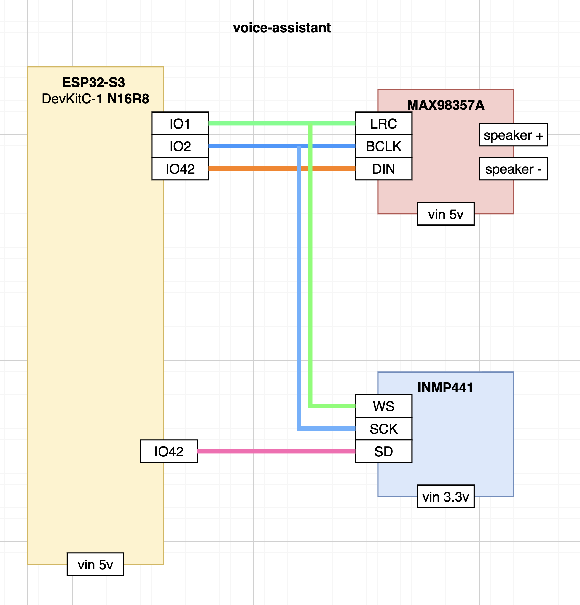
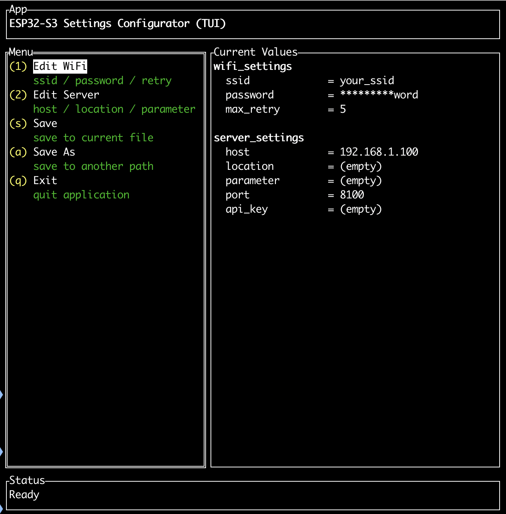
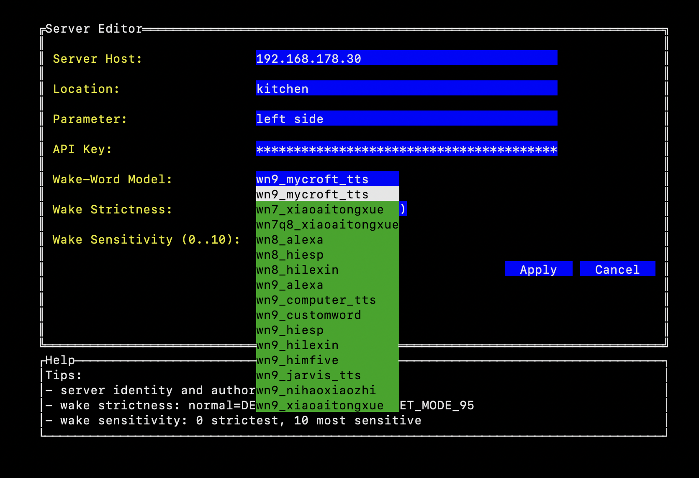
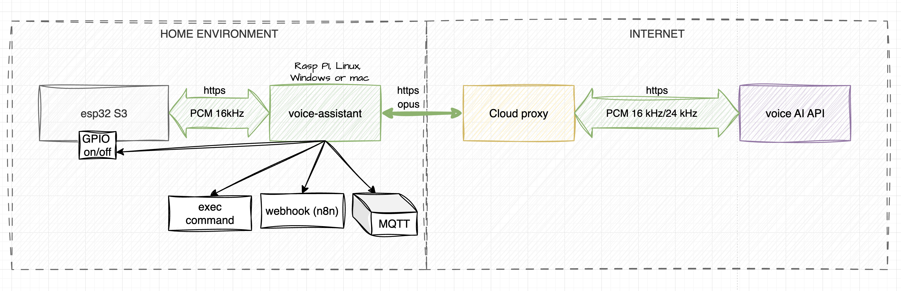
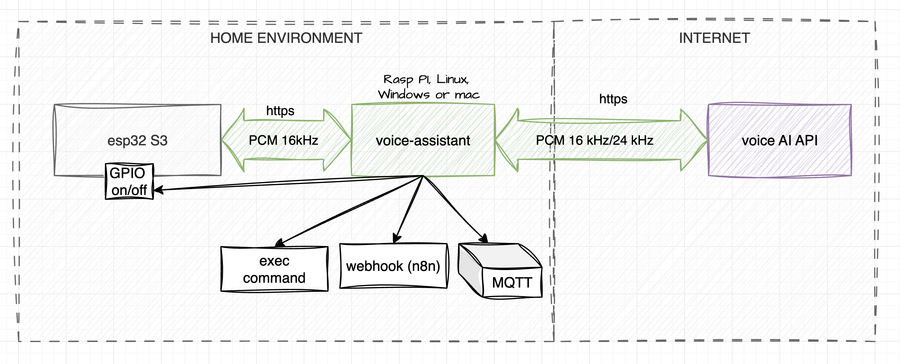

# AI Voice Assistant (ESP32-S3 Client)

> **Real conversational AI in your home.**
> 
> Client-side component for an **AI**-based voice assistant with traffic compression support and smart home, device, and host control.


## Table of Contents

- [About the project](#about-the-project)
  - [Key Features](#key-features)
- [Hardware](#hardware)
  - [Wiring](#wiring)
  - [PCB](#pcb)
- [Installation and Setup](#installation-and-setup)
  - [1.1 Configuration](#11-configuration)
  - [1.2 Configuration manual](#12-configuration-manual)
  - [Build & Upload](#2-build--upload)
- [System Architecture](#system-architecture)
  - [PROD env](#prod-env)
  - [DEV env](#dev-env)
  - [What is difference between PROD and DEV ?](#what-is-difference-between-prod-and-dev-)
- [License](#license)


## About the project

This project transforms the ESP32-S3 into a full-fledged interface for communicating with large language models. Unlike standard assistants that operate on a "command-response" basis, this one supports extended context and complex instruction execution.

### Key Features

- **Natural Dialogue:** Integration with **AI**.  
- **On-board Wake Word:** Activation by keyword phrase (configurable). Processing happens locally on the chip.
- **Function Calling:** The assistant can invoke functions on the host or controller:
    - **MQTT:** Sending commands to the broker.
    - **Webhook:** HTTP requests to external services (n8n, Home Assistant).
    - **GPIO:** Direct control of controller pins.
    - **Exec:** Running scripts on the local server.
- **⚡ Quick Start:** Convenient TUI utilities for one-command configuration and flashing.

---
## Hardware

1. **ESP32-S3** DevKitC-1 N16R8 module
2. **MAX98357A** I2S 3W Mono Amplifier Class D
3. **INMP441** - mic.

The microphone and speaker connect via I2S interface and share synchronization lines (BCLK/WS).

### Wiring

| **Peripheral**   | **Module**            | **ESP32-S3 Pins (Default)***                      | **Notes**                            |
| ---------------- | --------------------- | ------------------------------------------------- | ------------------------------------ |
| **Shared Lines** |                       | **BCLK (SCK)**: 2<br><br> <br><br>**WS (LRC)**: 1 | Connected in parallel to Mic and Amp |
| **Microphone**   | I2S INMP441           | **SD**: 16                                        | Connect L/R to GND                   |
| **Speaker**      | I2S MAX98357A         | **DIN**: 42                                       | Adjust Gain with resistor            |
Built into DevKitC-1                 |
Second leg to GND (Active Low)       |

> ⚠️ _**Important:** Pins are hardcoded in `src/main.c`. If you want to change them, edit the `#define` section at the beginning of the `src/main.c` file._
 
 



Detail schema: <a href="doc/images/voice-assistant-schema.png">schema</a>


### PCB

A Gerber file is available for a clean assembly.

**Download fabrication files:** [Gerber_VOICE_ASSISTANT.zip](doc/fabrication/Gerber_VOICE_ASSISTANT.zip)

---


## Installation and Setup

We've automated the configuration and build process using cross-platform scripts.

### 1.1 Configuration

Use the convenient TUI utility (text user interface) to configure device parameters. It will write the data (Wi-Fi, tokens, server settings) to the NVS partition.

**Run the configuration script:**

- **Linux / macOS:** `./configure_settings.sh`
- **Windows:** `configure_settings.cmd`

In the menu that opens, you can:

- Enter Wi-Fi **SSID and password**.
- Specify the **voice-assistant** address.
- Select and configure the **Wake Word** model (the phrase the assistant responds to).
- Enter authorization tokens.
- Tune audio parameters, including **Playback Volume (0-100%)**.




### parameters explanation:

- **Server Host** — the address where your voice-assistant is hosted. (required)
- **Location** — the field indicating where your controller is placed (e.g., kitchen); this is passed to the AI so it knows where to turn on the light, for example.
- **Parameter** — any custom information to help the AI (added to context).
- **API Key** — the key you generated in the <a href=https://voice-assistant.io>voice-assistant.io</a> service. (required)
- **Wake-Word Model** — select the model for the wake word (Alexa, Jarvis). (required)
- **Wake Detection Mode** — `normal` (DET_MODE_90) or `aggressive` (DET_MODE_95); affects false positives (`strict` is accepted as legacy alias of `aggressive`).
- **Wake Sensitivity (0–10)** — microphone sensitivity (affects false positives).
- **Playback Volume (0–100)** — output gain applied to PCM before I2S playback (mapped internally 1:1 to 0–100%).




### 1.2 Configuration manual
Just edit **settings.csv** file in your favorite editor.

### 2. Build & Upload

The `run_upload` script does everything at once: compiles the project, uploads the firmware to the ESP32, and launches the serial monitor.

**Run a single command:**

```bash
# Linux / macOS
./run_upload.sh

# Windows (PowerShell)
.\run_upload.ps1
```

> _The script will automatically detect the connected ESP32 port._

### 2.1 Upload Prebuilt Firmware (without rebuild)

Use `run_upload_firmware.sh` if you want to reuse the latest compiled binaries from the `firmware/` directory.

```bash
# Linux / macOS
./run_upload_firmware.sh

# Windows (PowerShell)
.\run_upload_firmware.ps1
```

Script behavior:
- If `firmware/` is missing or incomplete, it builds from sources, uploads, and refreshes `firmware/` cache.
- If `firmware/` already contains required files, it rebuilds only `settings.bin` from current `settings.csv`, then uploads cached firmware + model + fresh settings without full recompilation.

---

## System Architecture

The system consists of three parts:

1. **Client ESP32-S3:** "Ears and mouth". Listens for Wake Word, records audio, plays back responses.
2. **Voice Assistant (Agent):** Local middleware program. Handles noise suppression, Opus encoding/decoding, and maintains communication with the ESP32.
3. **Cloud Proxy:** Router to the voice AI.

**Data Flow:**

### PROD env




### DEV env




#### What is difference between PROD and DEV ?


The differences between PROD and DEV lie in how the model is used.

##### **For PROD environment:**
1. Uses the Enterprise Vertex model
2. Capable of web search
3. Stable operation
4. Model names don't change
5. Compressed voice traffic ~70 kb/sec
6. Automatic token-to-minutes conversion
7. Additional AI VAD and Noise Cancellation

##### **For DEV environment:**
1. You'll need your own API keys from Google STUDIO — it's free (conditionally)
2. You'll need to specify the model name and keep track of it (models change occasionally)
3. No web search (i.e., you can't get news or ask the model to search the internet)
4. No traffic compression
5. Sometimes models behave quite poorly (disconnect, fail to call functions, or call them unnecessarily)

The <a href='https://voice-assistant.io'>voice-assistant.io</a> service was created specifically to offset the drawbacks of both options: STUDIO and VERTEX.

**STUDIO** — free, but unstable and limited.

**VERTEX** — paid, but stable with web search and other features.

**VERTEX** — the billing system and configuration are an absolute nightmare (24 SKUs from several thousand line items, among other delights).

The voice-assistant.io service offers a simple and straightforward per-minute plan with per-second billing, access to stable models, and web search.

A convenient function editor is included — functions start working immediately without needing to restart the voice-assistant or controller.


---
License: MIT
